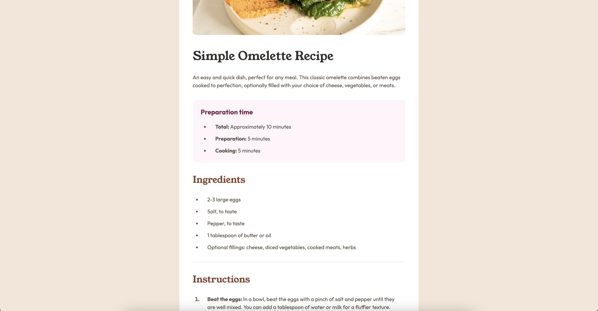

# Frontend Mentor - Recipe page solution

This is a solution to the [Recipe page challenge on Frontend Mentor](https://www.frontendmentor.io/challenges/recipe-page-KiTsR8QQKm). Frontend Mentor challenges help you improve your coding skills by building realistic projects. 

## Table of contents

- [Frontend Mentor - Recipe page solution](#frontend-mentor---recipe-page-solution)
  - [Table of contents](#table-of-contents)
  - [Overview](#overview)
    - [Screenshot](#screenshot)
    - [Links](#links)
  - [My process](#my-process)
    - [Built with](#built-with)
    - [Continued development](#continued-development)
    - [Useful resources](#useful-resources)

**Note: Delete this note and update the table of contents based on what sections you keep.**

## Overview

### Screenshot

### Links

- Live Site URL: [GitHub Pages - recipe-page-challenge](https://mkalmetieva.github.io/recipe-page-challenge/)

## My process

### Built with

- Semantic HTML5 markup
- CSS custom properties
- Mobile-first workflow
- External fonts included into CSS
- Using CSS variables for colors

### Continued development

### Useful resources

- [Everything You Need to Know About the Gap After the List Marker](https://css-tricks.com/everything-you-need-to-know-about-the-gap-after-the-list-marker/) - The length of the gap can be increased by adding a padding-left to `<ul>`, but only if the marker is positioned outside the list item (the default mode).
